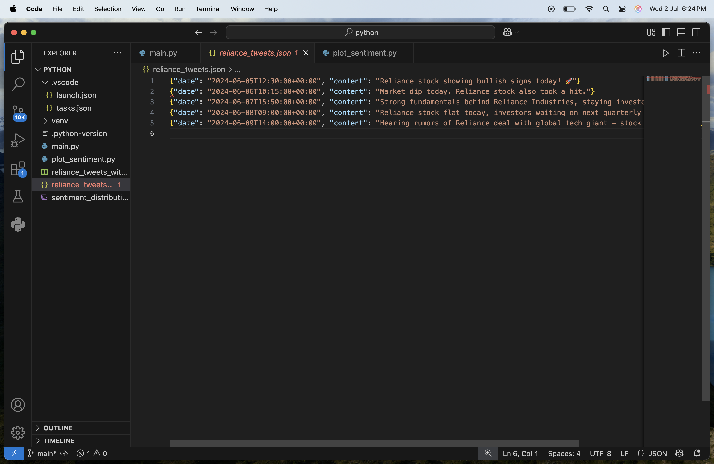
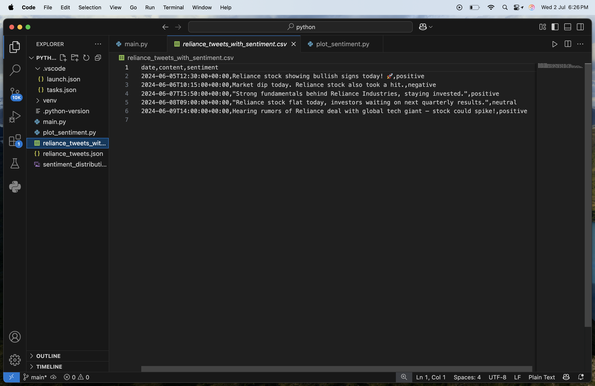
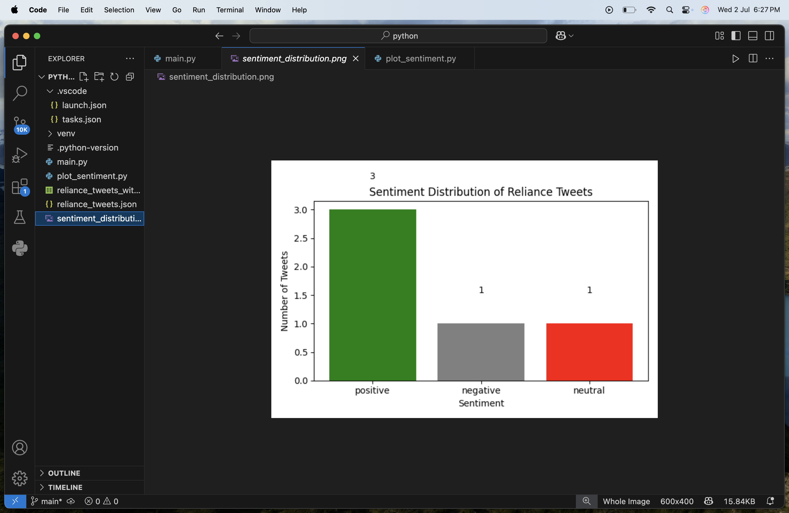

# 🧠 Twitter Stock Sentiment Analysis

This is a beginner-friendly NLP + Finance mini-project that explores the question:

**"Can Twitter sentiment predict stock market movement?"**

We use Natural Language Processing (NLP) to analyze the sentiment of tweets related to **Reliance stock** and visualize the results — aiming to spot trends or mood shifts that may correlate with market activity.

---

## 📌 Project Goal

- Learn how **social media sentiment** (specifically Twitter) might influence or reflect **stock market movement**.
- Apply **text processing**, **sentiment analysis**, and **data visualization** to real-world financial context.
- Build a mini-project suitable for your **portfolio or LinkedIn**.

---

## 🛠️ Tools & Libraries

- Python
- `pandas` – for data handling
- `textblob` – for sentiment analysis
- `matplotlib` – for visualization

---

## 📥 How the Data Was Collected

> 📌 Originally, we planned to use `snscrape` to scrape real-time tweets.  
> ❌ However, due to SSL Certificate issues and Mac compatibility problems, this was not feasible.

### ✅ Instead, we simulated real-world data using a **mock tweet dataset** with realistic stock-related sentiment, formatted like this:

```csv
date,content
2024-06-05,Reliance stock showing bullish signs today! 🚀
2024-06-06,Market dip today. Reliance stock also took a hit.

```
## 🖼️ Project Screenshots

### 🧾 Sample Tweet Data


### 📊 Sentiment CSV Preview


### 📈 Sentiment Distribution Bar Chart

