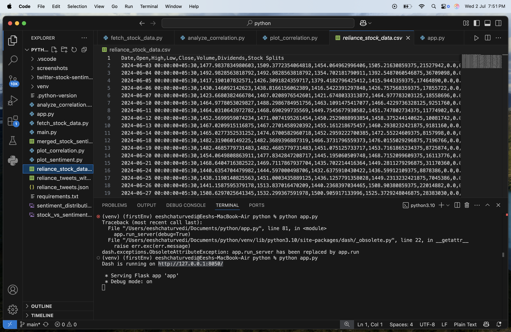
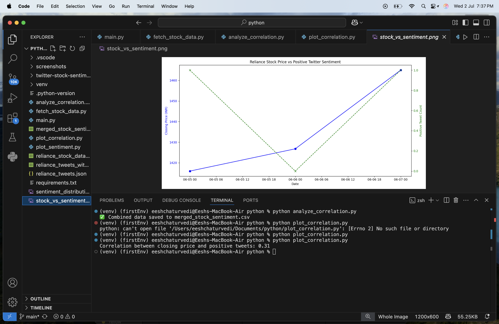
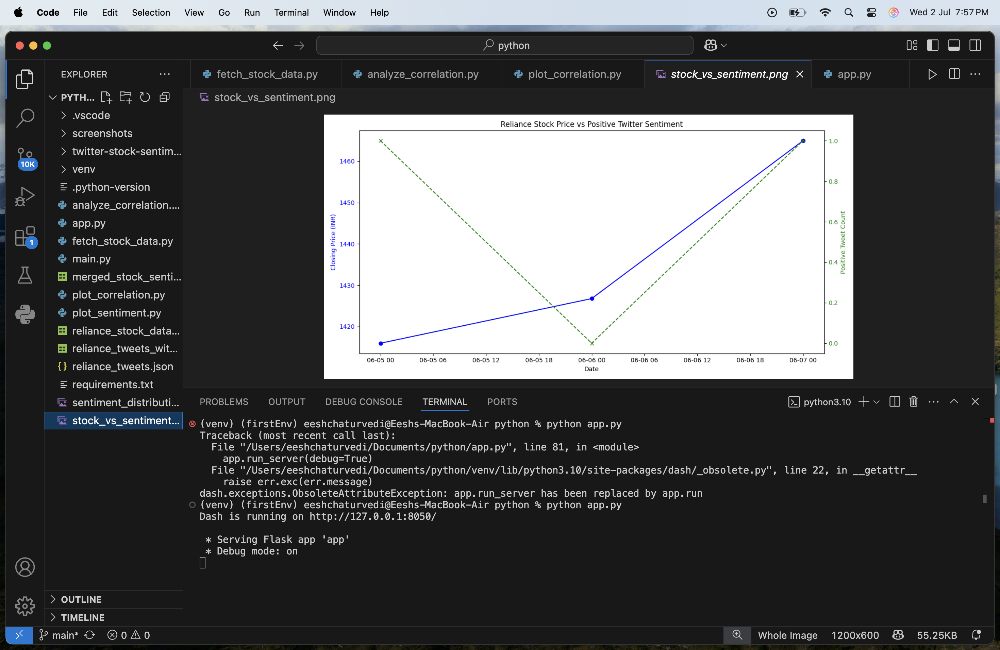
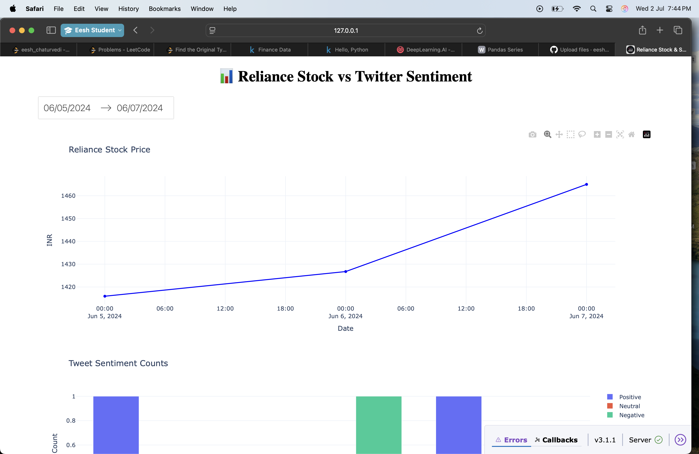
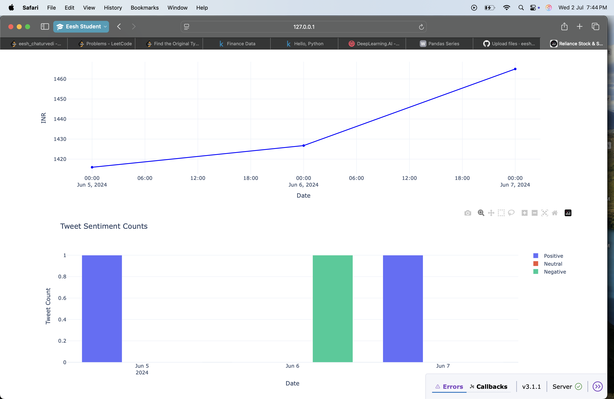
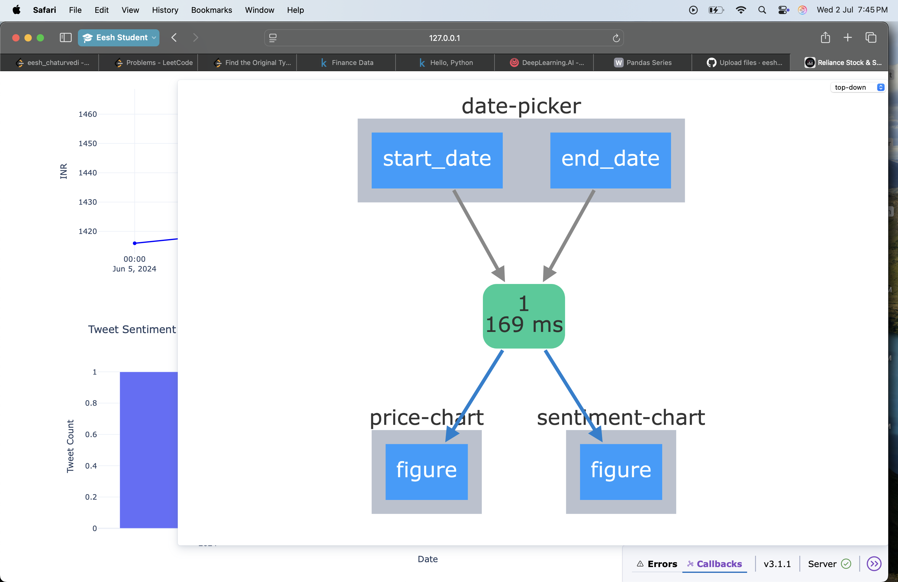

# 🧠 Twitter Stock Sentiment Analysis

This is a beginner-friendly NLP + Finance mini-project that explores the question:

**"Can Twitter sentiment predict stock market movement?"**

We use Natural Language Processing (NLP) to analyze the sentiment of tweets related to **Reliance stock** and visualize the results — aiming to spot trends or mood shifts that may correlate with market activity.

---

## 📌 Project Goal

- Learn how **social media sentiment** (specifically Twitter) might influence or reflect **stock market movement**.
- Apply **text processing**, **sentiment analysis**, and **data visualization** to real-world financial context.
- Build a mini-project suitable for your **portfolio or LinkedIn**.

---

## 🛠️ Tools & Libraries

- Python
- `pandas` – for data handling
- `textblob` – for sentiment analysis
- `matplotlib` – for visualization

---

## 📥 How the Data Was Collected

> 📌 Originally, we planned to use `snscrape` to scrape real-time tweets.  
> ❌ However, due to SSL Certificate issues and Mac compatibility problems, this was not feasible.

### ✅ Instead, we simulated real-world data using a **mock tweet dataset** with realistic stock-related sentiment, formatted like this:

```csv
date,content
2024-06-05,Reliance stock showing bullish signs today! 🚀
2024-06-06,Market dip today. Reliance stock also took a hit.

```
## 🖼️ Project Screenshots

### 🧾 Sample Tweet Data


### 📊 Sentiment CSV Preview


### 📈 Sentiment Distribution Bar Chart


## 📈 Real Stock Data (from Yahoo Finance)

We used the `yfinance` library to pull actual daily stock prices for Reliance Industries (RELIANCE.NS) from Yahoo Finance.

Code in [`fetch_stock_data.py`](fetch_stock_data.py)


## 📈 Stock Data with yFinance

We used the `yfinance` Python library to fetch **historical stock price data** for Reliance Industries.

### 🔍 What We Collected:
- Daily **Open**, **High**, **Low**, **Close**, and **Volume** data
- Fetched using: `yfinance.download("RELIANCE.NS", start="2024-06-01", end="2024-06-30")`

This data was merged with our sentiment-labeled tweets to explore the **relationship between public sentiment and stock movement**.

### 🧪 Sample Code:
```python
import yfinance as yf

# Download stock data
df = yf.download("RELIANCE.NS", start="2024-06-01", end="2024-06-30")
df.reset_index(inplace=True)
df.to_csv("reliance_stock_data.csv", index=False)

```


## 🖼️ yFinance Data & Visuals

### 📁 Reliance Stock CSV Preview
Shows historical stock data collected via yFinance:


### 📉 Reliance Stock Price Chart
Line chart of closing prices for the selected date range:


### 🔗 Merged Sentiment + Stock Data
Combined dataset of tweets, sentiment scores, and corresponding stock prices:



## 📊 Interactive Dash App

This project now includes a Dash-based interactive web dashboard!

### Features:
- Date range picker to filter tweet and stock data
- Dynamic stock price line chart
- Grouped sentiment bar chart by day

### 🔗 Run the app:
```bash
python app.py

```

## 💻 Dash App Screenshots

### 🧩 Full Dashboard View
Interactive Dash app combining tweet sentiments and stock prices:


### 📊 Sentiment Distribution Chart
Bar chart showing daily distribution of positive, negative, and neutral tweets:


### 📈 Stock Price Trend
Line chart showing Reliance stock closing price over time:

